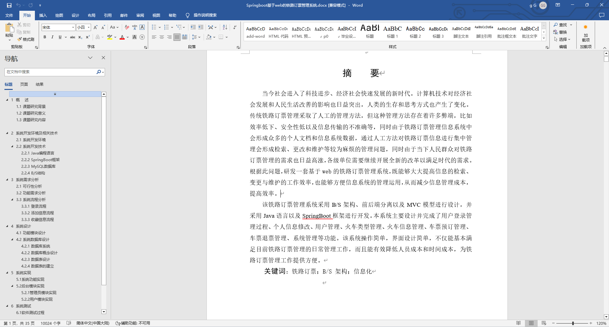
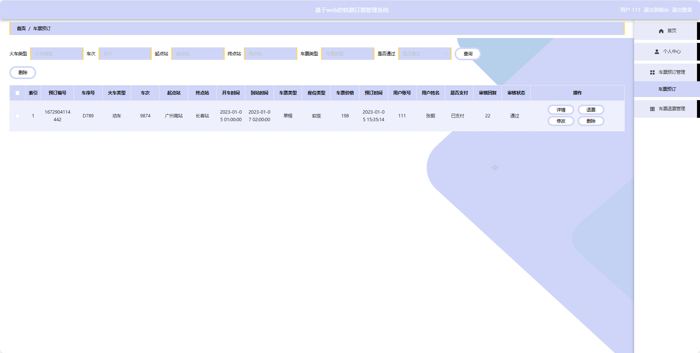
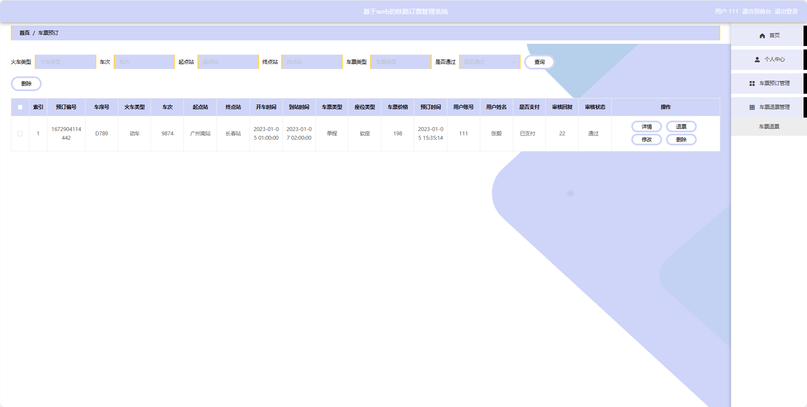
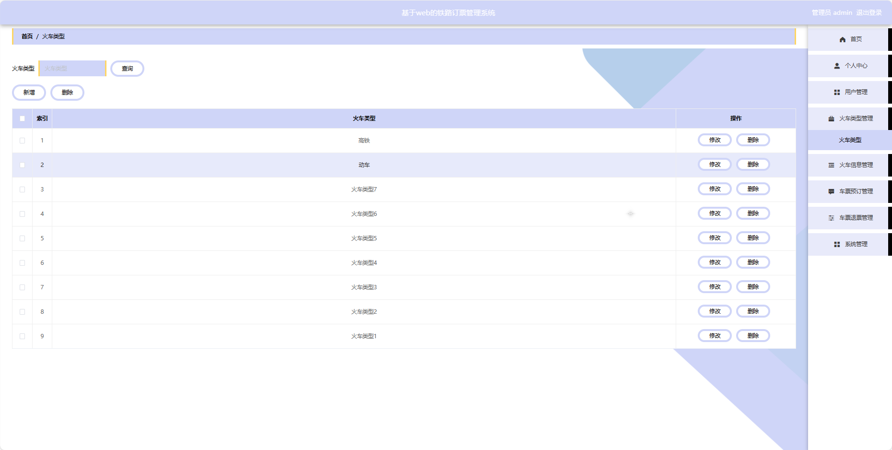
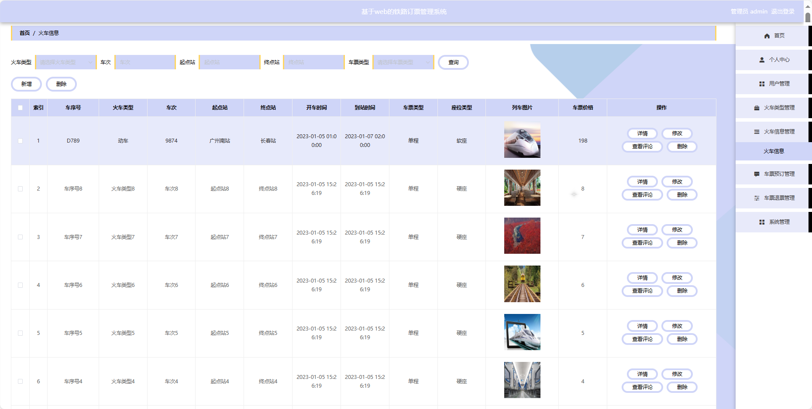
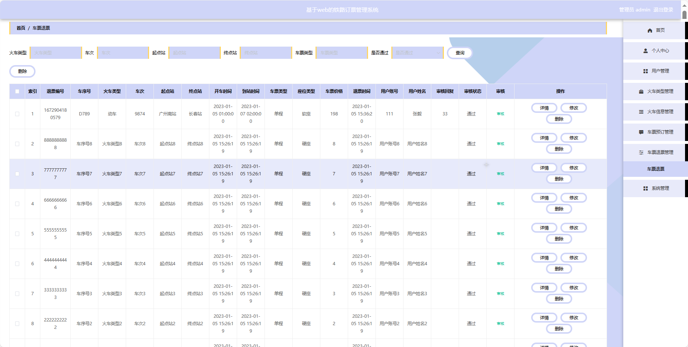

## 基于SpringBoot的铁路订票管理系统(程序+报告)

###  获取sql数据库文件: 从戎源码网 (https://armycodes.com/) QQ: 386869957 QQ群: 377586148
###  所有系统地址: (https://github.com/YuLin-Coder/AllProjectCatalog) 
###  所有项目以及源代码本人均调试运行无问题 可支持远程安装部署调试、定制修改、代码讲解

## 项目介绍
基于SpringBoot的铁路订票管理系统，系统包含两种角色：管理员、用户主要功能如下。

### 【管理员】:
首页：查看铁路订票管理系统。
个人中心：修改密码、管理个人信息。
用户管理：审核和管理注册用户的信息。
火车类型管理：管理系统中的火车类型信息。
火车信息管理：监管和管理系统中的火车信息，添加、编辑、删除等。
车票预订管理：处理用户的车票预订请求。
车票退票管理：处理用户的车票退票请求。
系统管理：管理系统的基本设置，公告资讯、关于我们、系统简介和轮播图管理。

### 【用户】:
首页：浏览铁路订票管理系统的主要信息。
火车信息：查看火车的相关信息，包括车次、出发地、目的地和票价等。
公告资讯：阅读系统发布的相关通知和资讯。
后台管理：进行系统首页、个人中心、车票预订管理、车票退票管理等操作。
个人中心：管理个人信息，查看订单历史记录等。

## 项目技术
- 编程语言：Java
- 数据库：MySQL
- 项目管理工具：Maven
- 前端技术：HTML、CSS、JavaScript、Jquery、Vue
- 后端技术：Spring、SpringMVC、MyBatis

## 运行环境
- JDK版本：JDK1.8及以上
- 开发工具：IDEA、Ecplise、Myecplise都可以
- 数据库: MySQL5.7及以上
- Maven：maven3.0及以上
- Node：14.14.0及以上

## 运行截图

